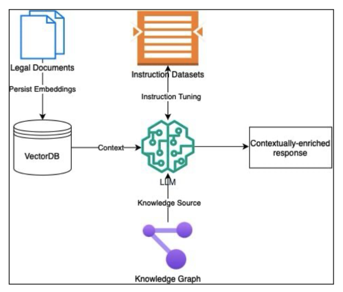

# Legislative QA System using RAG + Knowledge Graphs

We are planning to build a **Question-Answering platform for the legislative domain** by combining **Retrieval-Augmented Generation (RAG)** and **Knowledge Graphs** to provide **contextually rich, accurate answers to legal questions**.

Our goal is to enable intelligent interaction with large collections of legal documents and provide detailed responses grounded in factual knowledge.

---

## 🎯 Objectives

- Build a **lightweight** and **accessible** legal QA system
- Leverage **small language models** within a **RAG pipeline**
- Augment language models with **structured knowledge graphs**
- Achieve **comparable accuracy to large-scale LLMs**
- Enable deployment on **edge devices** and **low-resource systems**

---
### 📊 Architecture Diagram

